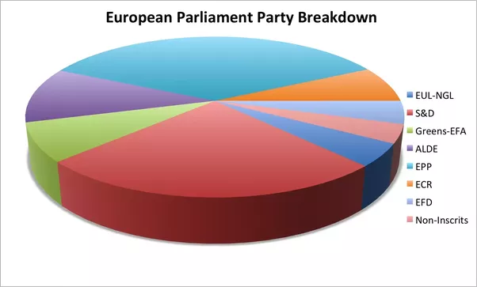
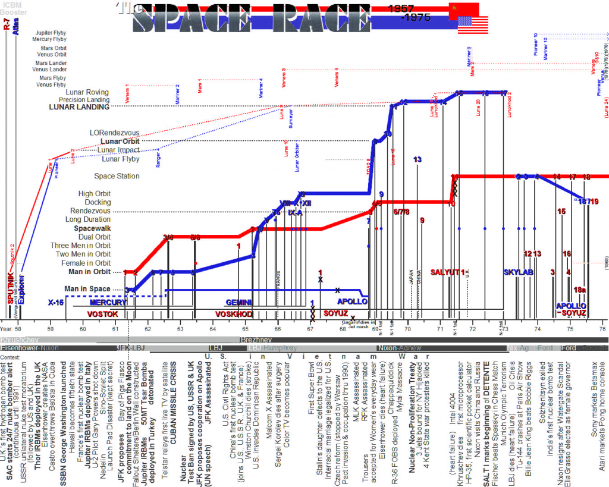
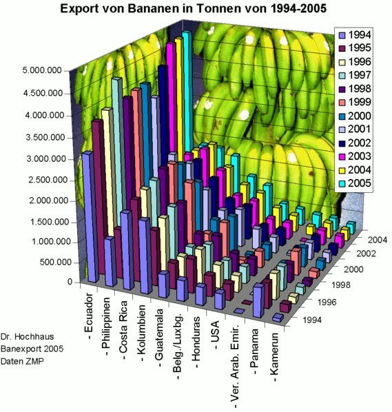
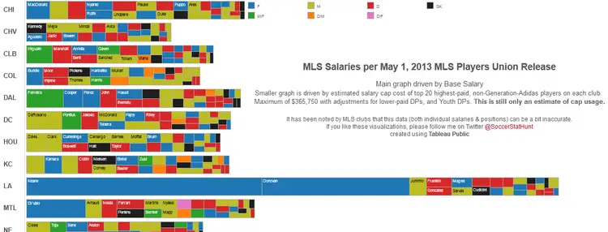
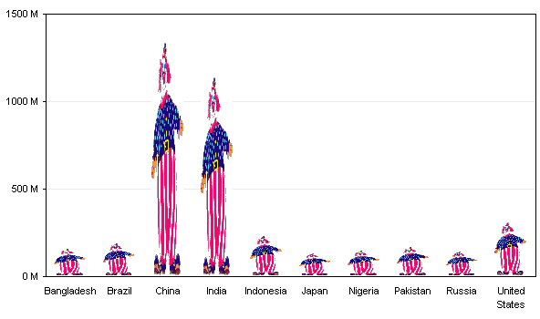
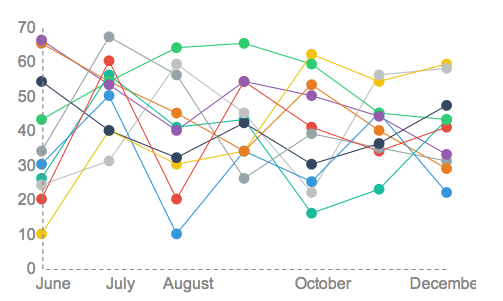
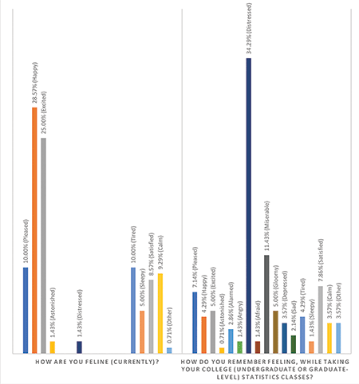
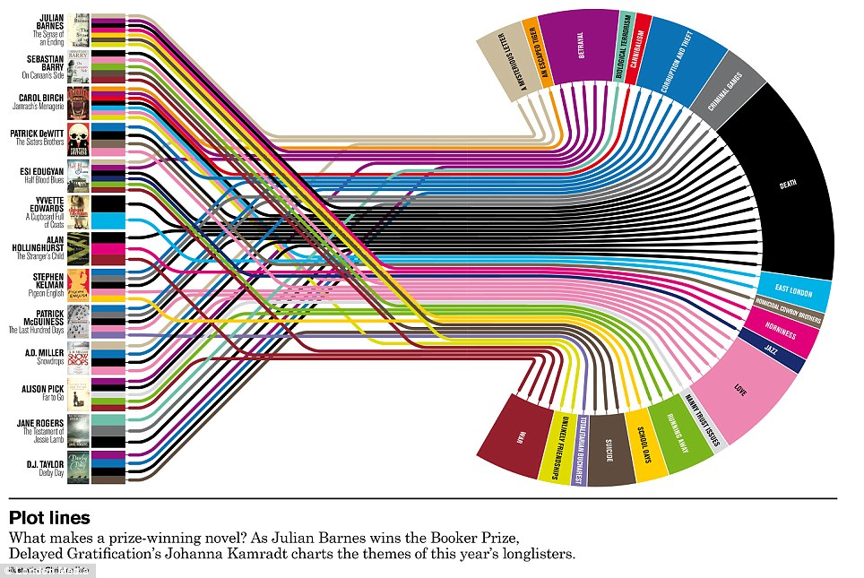

# Data Visualization

## Introduction

In this exercise we will be exploring a few different datasets, performing some visual exploratory data analysis to figure out the story we want to tell. We will be practicing plotting in `matplotlib` and `seaborn`. 

## Basic

### Part 1: Bad Graphs
This exercise will build complexity gradually. To start we will perform some exploratory data analysis to figure out the story we want to tell.

For each of the following misleading graphs, explain why you think it is misleading and, if possible, what you would do to fix that.

#### Question 1

#### Question 2

#### Question 3

#### Question 4

#### Question 5

#### Question 6

#### Question 7

#### Question 8

#### Question 9

### Part 2: Exploratory Data Analysis

#### Data
For Part 2, we will be using data on crime statistics that originally came from InfoChimps but has since been removed, but we have saved it for posterity in [data/crime.csv](data/crime.csv).

The data represents the number of reported crimes (per 100,000 population) across seven categories of crimes. They are broken up into:

* **Violent Crimes**: Murder, Aggravated Assault, Robbery
* **Property Crimes**: Burglary, Larceny Theft, Motor Vehicle Theft

*Note: for the following problems, we will suggest a visualization package to use, however you can use which ever one you want*

1. Load the dataset into pandas
2. Perform some EDA to answer the following questions:
    * Which states have the highest/lowest rate of each of the six crimes?
    * Across the states, are any of the crimes highly correlated?
3. Using `seaborn`, create a heatmap of these correlations
4. Create a histogram for each of the six crimes to visualize their distributions using either `seaborn` or `pandas`.
5. Create a KDE plot as well for each of the seven crimes using whichever plotting package you want.
6. Which one displays the distributions better, a histogram or a KDE plot?
7. To get a better sense of how these distributions compare, create multiple box-plots on a single plot.
8. Compare *Aggravated Assault* and *Motor Vehicle Theft* on its own plot using a **violin plot** on the same plot
9. What information does the box-plot more easily provide us? And which aspect of the distributions does the violin plot better communicate?
10. Draw some basic conclusions from the EDA of the `crimes` data based on the graphs that you have created.

## Advanced
### Part 3: More EDA
Here we have given you a few datasets to choose from. Based on these, pick one (or all if you have time) and perform some basic EDA like you did in the [Basic](#basic) section. Draw some conclusions from this data and create a story based on what you are seeing in the data.

#### Data
* [MT Cars Dataset](data/mtcars.csv): The data was extracted from the 1974 Motor Trend US magazine, and comprises fuel consumption and 10 aspects of automobile design and performance for 32 automobiles (1973--74 models). [Source](https://stat.ethz.ch/R-manual/R-devel/library/datasets/html/mtcars.html)

    | feature| Description|
    |---|---|
    | **mpg** |	Miles/(US) gallon |
    | **cyl** |	Number of cylinders |
    | **disp** |	Displacement (cu in) |
    | **hp** |	Gross horsepower |
    | **drat** | 	Rear axle ratio |
    | **wt** |	Weight (1000 lbs) |
    | **qsec** |	1/4 mile time |
    | **vs** |	Engine (0 = V-shaped, 1 = straight) |
    | **am** |	Transmission (0 = automatic, 1 = manual) |
    | **gear** |	Number of forward gears |
    | **carb** |	Number of carburetors |

* [Concrete dataset](data/concrete_data.csv): Concrete is the most important material in civil engineering. The concrete compressive strength is a highly nonlinear function of age and ingredients. [Source](https://archive.ics.uci.edu/ml/datasets/Concrete+Compressive+Strength)

    | feature| Description|
    |---|---|
    | **Cement (component 1)** |	quantitative -- kg in a m3 mixture -- Input Variable |
    | **Blast Furnace Slag (component 2)** |	quantitative -- kg in a m3 mixture -- Input Variable |
    | **Fly Ash (component 3)** |	quantitative -- kg in a m3 mixture -- Input Variable |
    | **Water (component 4)** |	quantitative -- kg in a m3 mixture -- Input Variable |
    | **Superplasticizer (component 5)** | 	quantitative -- kg in a m3 mixture -- Input Variable |
    | **Coarse Aggregate (component 6)** |	quantitative -- kg in a m3 mixture -- Input Variable |
    | **Fine Aggregate (component 7)** |	quantitative -- kg in a m3 mixture -- Input Variable |
    | **Age** |	quantitative -- Day (1~365) -- Input Variable |
    | **Concrete compressive strength** |	quantitative -- MPa -- Output Variable |

## Extra Credit
### Part 4: Find your own bad graphs
Now for the fun part!  

Now that you have identified what makes a good versus a bad graph, look for some on your own and share with your cohort.
